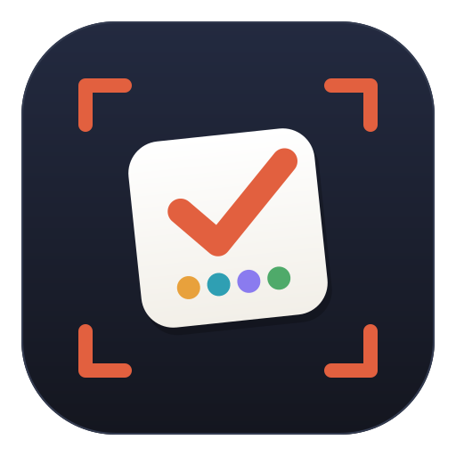

<p align="center">
  
</p>

<h1 align="center">FAQ — najczęstsze pytania</h1>

<p align="center">
  Krótkie odpowiedzi na to, o co pytają nauczyciele przed pierwszą lekcją
  i w jej trakcie. Instalacja krok po kroku: <a href="INSTALACJA.md">INSTALACJA.md</a>
</p>

---

## Spis treści

- [Na start](#na-start)
- [Karty i kamera](#karty-i-kamera)
- [Prowadzenie quizu](#prowadzenie-quizu)
- [Pytania, wzory i media](#pytania-wzory-i-media)
- [Wygląd i dźwięk](#wygląd-i-dźwięk)
- [Raporty i oceny](#raporty-i-oceny)
- [Aktualizacje](#aktualizacje)
- [Prywatność i szkolne IT](#prywatność-i-szkolne-it)
- [Problemy](#problemy)

---

## Na start

<details open>
<summary><b>Czy to jest darmowe i czy są limity?</b></summary>

Tak, w całości. Licencja MIT, brak kont, brak limitu uczniów, pytań ani quizów.
Nic nie wysyła się do chmury — aplikacja działa na Twoim komputerze.
</details>

<details>
<summary><b>Czy uczniowie potrzebują telefonów?</b></summary>

Nie. To główna różnica wobec Kahoota. Każdy uczeń dostaje jedną wydrukowaną
kartę i podnosi ją odwróconą wybraną literą do góry. Telefon (jeden, Twój)
przydaje się co najwyżej jako kamera.
</details>

<details>
<summary><b>Czy potrzebuję internetu?</b></summary>

Nie do prowadzenia lekcji. Internet jest potrzebny tylko przy pobieraniu
programu i przy sprawdzaniu aktualizacji (można wyłączyć w panelu).
</details>

<details>
<summary><b>Jaki komputer to udźwignie?</b></summary>

Dowolny z ostatniej dekady. Rozpoznawanie markerów to lekka operacja —
obciążenie bierze się głównie z odczytu obrazu z kamery.
</details>

<details>
<summary><b>Windows, Linux, macOS?</b></summary>

Wszystkie trzy. Na Windows najprościej pobrać gotowy plik `QuizScanner-v….exe`
z [Releases](https://github.com/PiotrKajor/QuizScanner/releases). Na Linuksie
i macOS: `./scripts/install.sh`, potem `./start.sh`.
</details>

---

## Karty i kamera

<details>
<summary><b>Skąd wziąć karty do druku?</b></summary>

Edytor → zakładka **Uczniowie** → **„📄 Pobierz karty (PDF)"**. Dostaniesz PDF
z kartą dla każdego ucznia z listy, po jednej na stronę A4 (z imieniem i numerem).
</details>

<details>
<summary><b>Na czym drukować?</b></summary>

Zwykły biały papier, druk **matowy**. Błyszczący papier i folia odbijają światło
lamp, przez co kamera gubi marker. Warto zalaminować matową folią, jeśli karty
mają przetrwać rok.
</details>

<details>
<summary><b>Z jakiej odległości to działa?</b></summary>

Marker o boku ~8–10 cm (czyli karta A5) czyta się z 4–6 metrów przy przyzwoitej
kamerze HD. Większa sala = większa karta (A4) albo lepsza kamera.
</details>

<details>
<summary><b>Ilu uczniów naraz?</b></summary>

Jeden kadr wykrywa całą klasę jednocześnie — ograniczeniem jest to, ile kart
mieści się w kadrze na tyle dużych, by je odczytać. Domyślny słownik markerów
obsługuje 250 różnych numerów uczniów.
</details>

<details>
<summary><b>Uczeń zgubił kartę.</b></summary>

Wydrukuj samą jego kartę ponownie — numer (ID) zostaje ten sam, więc wyniki
i tak trafią do właściwej osoby.
</details>

<details>
<summary><b>Nie mam kamery internetowej.</b></summary>

Użyj telefonu: **IP Webcam** (Android) albo **Iriun Webcam** / **DroidCam**
(Android i iPhone). Telefon i komputer w tej samej sieci Wi-Fi, w panelu
wpisujesz adres strumienia, np. `http://192.168.1.50:8080/video`. Przycisk
**„📱 Jak podłączyć telefon?"** w panelu prowadzi za rękę.
</details>

<details>
<summary><b>Kamera pokazuje obraz lustrzany — to problem?</b></summary>

Nie. Lustro dotyczy tylko podglądu dla Ciebie; rozpoznawanie działa na
oryginalnej klatce.
</details>

---

## Prowadzenie quizu

<details>
<summary><b>Czym różni się tryb ręczny od automatycznego?</b></summary>

W ręcznym Ty klikasz **Start pytania → Pokaż wynik → Następne**. W automatycznym
quiz robi to sam: po upływie czasu pokazuje wynik, odczekuje chwilę i przechodzi
dalej. Czasy ustawisz w edytorze („Auto: ile pokazywać wynik", „Auto: przerwa").
</details>

<details>
<summary><b>Uczeń zmienił zdanie w trakcie pytania.</b></summary>

Liczy się ostatnia pozycja karty przed upływem czasu. Zmiany są normalne —
system zapamiętuje moment ostatniej zmiany (ważne przy punktach za szybkość).
</details>

<details>
<summary><b>Punkty stałe czy za szybkość?</b></summary>

Domyślnie stałe: każda poprawna odpowiedź warta tyle samo. Przełącznik
**„Punkty za szybkość"** włącza tryb w stylu Kahoota — im szybciej uczeń
ustawił kartę, tym więcej punktów (od 50% do 100% puli).
</details>

<details>
<summary><b>Czy mogę losować kolejność pytań i odpowiedzi?</b></summary>

Tak, w ustawieniach quizu w edytorze. Losowanie odpowiedzi ustala się raz na
pytanie, więc tablica nie „miga", a poprawna litera liczona jest po przetasowaniu.
</details>

<details>
<summary><b>Ktoś macha kartą w tle i psuje statystyki.</b></summary>

Zostaw włączony przełącznik **„Tylko uczniowie z listy"** — kody spoza listy
klasy są ignorowane.
</details>

<details>
<summary><b>Jak pokazać tablicę na rzutniku z drugiego komputera?</b></summary>

Otwórz na nim adres **„Tablica w sieci"** wyświetlany w panelu nauczyciela
(np. `http://192.168.1.20:8000/board`). Oba urządzenia muszą być w tej samej
sieci. Działa też na Smart TV z przeglądarką.
</details>

---

## Pytania, wzory i media

<details>
<summary><b>Jak wstawić wzór matematyczny?</b></summary>

W edytorze jest **przybornik matematyczny**: kliknij pole pytania lub
odpowiedzi, a potem symbol. Masz działania, potęgi i indeksy, ułamki, alfabet
grecki, zbiory i logikę, geometrię oraz analizę (∑, ∫, lim…). Pod przybornikiem
widzisz **podgląd na żywo** — dokładnie to, co zobaczą uczniowie na tablicy.

Szablony wstawiają gotowy szkielet: zaznacz `x+1`, kliknij `√( )`, a dostaniesz
`√(x+1)`. Przyciski `x²` i `x₂` zamieniają zaznaczony fragment na indeks górny
lub dolny.
</details>

<details>
<summary><b>Czy mogę pisać w LaTeX-u?</b></summary>

Tak. Wzór zamykasz w dolarach, a renderuje go **KaTeX**:

```
Ile wynosi $\frac{1}{2} + \frac{1}{4}$ ?
Pole koła: $\pi r^2$
$$\begin{cases} x + y = 2 \\ x - y = 0 \end{cases}$$
```

Podwójne dolary `$$…$$` dają wzór wyśrodkowany w osobnej linii. W przyborniku
jest sekcja **LaTeX** z gotowymi szablonami: ułamek piętrowy, pierwiastek
stopnia n, całka z granicami, suma, granica, symbol Newtona, wektor, układ
równań, macierz.
</details>

<details>
<summary><b>Kiedy Unicode, a kiedy LaTeX?</b></summary>

Do prostych rzeczy (`x²`, `√2`, `≤`, `π`, `H₂O`) wystarczy Unicode — jest
lżejszy i wygląda identycznie wszędzie, także w raporcie. LaTeX bierz do tego,
czego Unicode nie zapisze: ułamków piętrowych, całek i sum z granicami,
macierzy, układów równań.
</details>

<details>
<summary><b>Czy KaTeX pobiera coś z internetu?</b></summary>

Nie. Cała biblioteka razem z czcionkami leży w repozytorium
(`quizscanner/web/vendor/katex`, ok. 600 kB) i jest wbudowana w plik `.exe`.
Aplikacja dalej działa w pełni offline.
</details>

<details>
<summary><b>Jak wzory wyglądają w raporcie?</b></summary>

Raport to samodzielny plik, który ma się otworzyć wszędzie — także bez
QuizScannera — więc wzory zapisywane są w nim tekstem: `$\frac{1}{2}$` →
`(1)/(2)`, `$\pi r^2$` → `π r²`, `$\sqrt[3]{27}$` → `³√(27)`. Dotyczy to
wszystkich formatów poza **JSON**, w którym zostaje pełny zapis LaTeX
(przydaje się, gdy chcesz przetworzyć wyniki własnym skryptem).
</details>

<details>
<summary><b>Wzór świeci się na czerwono.</b></summary>

To błąd składni LaTeX — najczęściej brakujący nawias klamrowy albo literówka
w nazwie polecenia. Podgląd pod przybornikiem pokazuje to od razu, jeszcze
zanim pytanie trafi na tablicę.
</details>

<details>
<summary><b>Jak wstawić zdjęcie albo film?</b></summary>

W edytorze przy pytaniu: **„🖼 Dodaj plik"**. Obsługiwane są JPG, PNG, GIF,
WEBP oraz filmy MP4 i WEBM, do 40 MB. Media pokazują się na tablicy razem
z pytaniem, a film odtwarza się automatycznie w pętli.
</details>

<details>
<summary><b>Jak podzielić się quizem z inną nauczycielką?</b></summary>

**„⬇ Zapisz do pliku"** tworzy jeden plik `.quiz` z pytaniami, ustawieniami
**i osadzonymi zdjęciami/filmami**. Odbiorca klika **„⬆ Wczytaj z pliku"**
i ma komplet.
</details>

---

## Wygląd i dźwięk

<details>
<summary><b>Jakie są motywy kolorystyczne?</b></summary>

Siedem: **Ciemny** (domyślny), Jasny, Ocean, Las, Zachód słońca, Cukierkowy
i Wysoki kontrast. Wybór z listy w prawym górnym rogu panelu lub edytora
działa od razu także na tablicy — również gdy tablica stoi na innym komputerze.
</details>

<details>
<summary><b>Który motyw na rzutnik w jasnej sali?</b></summary>

**Wysoki kontrast** (czerń + żółć) albo **Ocean**. Motyw Cukierkowy jest jasny
i sprawdza się raczej na monitorze niż na słabym projektorze.
</details>

<details>
<summary><b>Co dokładnie brzmi na tablicy?</b></summary>

Sygnał startu pytania, ciche odliczanie w ostatnich pięciu sekundach (ostatnia
wyżej), koniec czasu, fanfara przy pokazaniu wyniku i przy podium. Dźwięki są
generowane w przeglądarce — nie ma żadnych plików audio.
</details>

<details>
<summary><b>Tablica pisze „Kliknij ekran, aby włączyć dźwięki".</b></summary>

Tak działa zabezpieczenie przeglądarek: żadna strona nie zagra, dopóki
użytkownik czegoś nie kliknie. Jedno kliknięcie w tablicę i komunikat znika.
</details>

<details>
<summary><b>Da się wyciszyć albo przyciszyć?</b></summary>

Tak — przełącznik **„Dźwięki tablicy"** i suwak głośności w panelu nauczyciela
(karta „Ustawienia aplikacji").
</details>

---

## Raporty i oceny

<details>
<summary><b>Gdzie znajdę wyniki po lekcji?</b></summary>

Przycisk **„📊 Raport"** w panelu pokazuje podsumowanie: ranking, skuteczność
każdego ucznia, statystyki pytań i najtrudniejsze pytanie. Stamtąd pobierasz
plik w wybranym formacie.
</details>

<details>
<summary><b>W jakich formatach?</b></summary>

| Format | Do czego |
|---|---|
| **PDF** | wydruk, teczka wychowawcy, załącznik do maila |
| **Excel (XLSX)** | dziennik, obliczanie ocen |
| **CSV** | import do innego programu (średnik + BOM, Excel otwiera bez kreatora) |
| **HTML** | podgląd w przeglądarce, wydruk jednym Ctrl+P |
| **JSON** | dane do własnych zestawień i skryptów |
| **TXT** | szybki podgląd, wklejenie do wiadomości |
</details>

<details>
<summary><b>Muszę pamiętać o zapisaniu raportu?</b></summary>

Nie. Po ostatnim pytaniu (czyli po pokazaniu podium) raport zapisuje się sam
do `data/raporty/` w formatach HTML, CSV i JSON. Można to wyłączyć
przełącznikiem **„Automatyczny raport"**.
</details>

<details>
<summary><b>Co dokładnie jest w raporcie?</b></summary>

Ranking z punktami i skutecznością, odpowiedź każdego ucznia na każde pytanie
(kolumny `P1`, `P2`, …), rozkład A/B/C/D dla każdego pytania, średnie i wskazanie
pytania, które poszło najgorzej.
</details>

<details>
<summary><b>Czy QuizScanner wystawia oceny?</b></summary>

Nie — daje punkty i procent skuteczności. Przelicznik na oceny zostaje po Twojej
stronie (najwygodniej w pliku Excela).
</details>

---

## Aktualizacje

<details>
<summary><b>Skąd wiem, że jest nowa wersja?</b></summary>

Program przy starcie pyta GitHuba o najnowsze wydanie. Gdy jest coś nowszego,
u góry panelu nauczyciela pojawia się pasek z numerem wersji.
</details>

<details>
<summary><b>Jak zaktualizować?</b></summary>

W wersji `.exe` wystarczy **„⬇ Zaktualizuj teraz"**: program pobiera nowy plik
obok obecnego i podmienia go przy zamykaniu (Windows nie pozwala nadpisać
działającego pliku). Wersję ze źródeł aktualizujesz przez `git pull`.
</details>

<details>
<summary><b>Nie chcę, żeby cokolwiek łączyło się z internetem.</b></summary>

Wyłącz przełącznik **„Sprawdzaj aktualizacje"**. Wtedy program nie wykonuje
żadnych połączeń na zewnątrz.
</details>

<details>
<summary><b>Czy aktualizacja skasuje moje quizy?</b></summary>

Nie. Wszystko Twoje leży w folderze `data/`, którego aktualizacja nie dotyka.
</details>

---

## Prywatność i szkolne IT

<details>
<summary><b>Gdzie trafiają dane uczniów?</b></summary>

Zostają na Twoim komputerze, w folderze `data/`. Nie ma serwera w chmurze ani
kont użytkowników. Wyniki opuszczają komputer tylko wtedy, gdy sam(a) wyślesz
wyeksportowany plik.
</details>

<details>
<summary><b>Czy muszę używać imion i nazwisk?</b></summary>

Nie. Lista uczniów może zawierać same numery albo inicjały — raport pokaże
to, co wpiszesz.
</details>

<details>
<summary><b>Czy to otwiera port w szkolnej sieci?</b></summary>

Aplikacja nasłuchuje lokalnie (domyślnie port 8000), żeby tablicę dało się
otworzyć na drugim komputerze w tej samej sieci. Nic nie jest wystawiane do
internetu. Jeśli tablica ma działać tylko na jednym komputerze, uruchom serwer
z `--host 127.0.0.1`.
</details>

<details>
<summary><b>Nie mam praw administratora.</b></summary>

Nie są potrzebne. Plik `.exe` nie wymaga instalacji — wystarczy skopiować go
na Pulpit czy pendrive'a i kliknąć. Ważne tylko, żeby folder pozwalał na zapis
(nie `Program Files`).
</details>

---

## Problemy

<details>
<summary><b>Podgląd kamery jest czarny.</b></summary>

Sprawdź, czy kamery nie zajmuje inny program (Teams, Zoom), spróbuj innego
numeru w polu **„Źródło obrazu"** (0, 1, 2…), a na Linuksie sprawdź uprawnienia
do `/dev/video0` (grupa `video`).
</details>

<details>
<summary><b>Część kart się nie czyta.</b></summary>

Najczęściej: za małe karty jak na odległość, odblaski z lampy/okna, zgięta lub
pofalowana kartka, ręka zasłaniająca róg markera. Cała czarna ramka markera musi
być widoczna.
</details>

<details>
<summary><b>Program wykrywa kody, których nie ma w klasie.</b></summary>

Włącz **„Tylko uczniowie z listy"**. Skaner dodatkowo odrzuca wzory bez wyraźnego
czarno-białego kontrastu, więc plakaty i wzorzyste ubrania zwykle nie przechodzą.
</details>

<details>
<summary><b>„Nie udało się uruchomić na porcie".</b></summary>

Port zajęty przez inny program — wpisz w oknie startowym inny, np. 8080.
</details>

<details>
<summary><b>Nie zapisują się quizy ani raporty.</b></summary>

Przenieś program do folderu z prawem zapisu (Pulpit, Dokumenty). W `Program Files`
Windows blokuje zapis.
</details>

<details>
<summary><b>W interfejsie widać krzaki zamiast polskich znaków.</b></summary>

To błąd, zgłoś go proszę — repozytorium ma nawet własny test tego
(`python tools/check_polish.py` oraz kontrola tłumaczeń w `tools/selftest.py`).
</details>

<details>
<summary><b>Coś innego nie działa.</b></summary>

Uruchom `python tools/selftest.py` — to szybkie sprawdzenie, czy wszystko
działa: strony, API, karty PDF, przebieg quizu i wszystkie formaty raportu.
Wynik wklej do zgłoszenia w
[Issues](https://github.com/PiotrKajor/QuizScanner/issues).
</details>

---

<p align="center">
  Nie ma tu Twojego pytania?
  <a href="https://github.com/PiotrKajor/QuizScanner/issues">Napisz w Issues</a> —
  odpowiedź trafi do tego FAQ.
</p>
